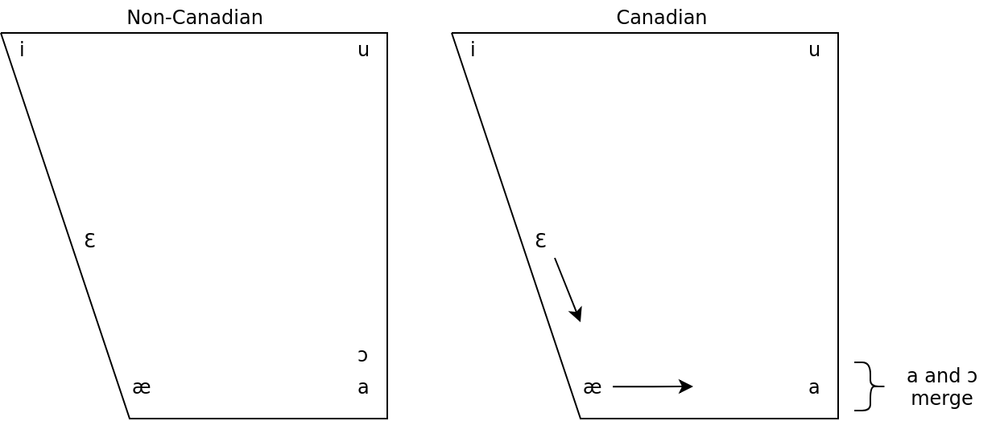

# Components of Language

## Lexicon

- things about language that must be memorized
- vocabulary
- idioms (kick the bucket, etc.)

## Phonology

- sounds combined into larger words

## Syntax

- words combined into larger units

## Semantics

- relate meaning of expressions to meaning of parts

# Design Features of Human Language

## Discreteness

- discrete units

## Productivity

- discrete infinity
- parts of messages can be used to create parts of new messages

## Recursion

- categories can contain themselves

## Duality of Patterning

- two layers of structure
- sounds -> words
- words -> sentences

## Arbitrariness of the Sign

- connection between sound and meaning is unpredictable
- exceptions
  - onomatopoeia
  - sound symbolism (kiki, buba)

## Displacement

- communicate about things not immediately present

## Reflexiveness

- use language to talk about language

## Cultural Learning

- acquisition from community

# Onomatopoeia

- words formed by association to a sound
  - woof
  - quack

# Sound Symbolism

- kiki and buba
- bang, fizz, slide, slippery

# Language Learning and Language Diversity Relationship

# Signed Languages

- not different from other language
  - hand gestures can count as phonemes
- same features as other human language
  - duality of patterning
  - arbitrariness of the sign
- ASL grammar distinct from English
  - verbal aspect
  - word order
  - classifiers

# Vocal Tract Anatomy

## Humans

- short tongue
- lower larynx
- easier to move tongue freely
- easier to choke

## Apes

- long tongue
- higher larynx

# Differences Between Humans and Animals

- in general
  - no true productivity
  - no discrete combinatorial system

## Bee Waggle Dance

- two continuous scales
  - duration
  - direction

## Ape Communication

- aggression
- submission

## Vervet Monkeys

- alarm calls specific to predators
- whole unit message
- no productivity
- only a lexicon

## Bird Song

- syrinx instead of larynx
  - vibrations in membrane of trachea
- learn song in stages
  1) subsong
  2) plastic song
  3) crystallized song
- made up of discrete units
  - A A B B A C
  - follow a few basic patterns

# Basic Results of Animal Learning Experiments

- rhesus monkeys and rats learn algebraic rules A B C A B C A B C
- tamarins, bengalese finches, pigeons and learn finite-state grammars
- humans and tamarins can learn regular grammars
- only humans can do context free

## Order of Complexity

1) Finite-State Grammars (algebraic patterns): rats, monkeys, tamarins, finches, pigeons
2) Regular Grammars: humans, tamarins
3) Context-Free Grammars: humans only

------------------------------------------------------------------------------

# Language Family

- descended from common ancestor speech community
- from a common proto-language
- English and German

# Cognates

- words that share common origin
- features shared due to common descent

# Proto-Languages

1) proto-indo-european
2) niger-congo
3) austronesian
4) trans-new-guinea
5) sino-tibetan
6) indo-european
7) afro-asiatic

# Comparative Method

- feature-by-feature comparison of two languages with common ancestor
- study language development

# Dialect Maps

- geographical distribution of language speakers
- isoglosses = marks the boundary between linguistic features

# The Canadian Shift

- Canadian shift moves "bet" low and "pat" back
- Nothern cities shift is the opposite, moves "bet" high and "pat" forward

# Connection Between Change and Variation

- change leads to variation
    - grammar 1 affects language 1
    - language 1 affects grammar 2
- over time we are changing our grammar
- divergence across areas where language is spoken

# Variations and Social Meaning

- Labov fourth floor study
  - variation between different social classes
- Labov department store study
  - upper and lower classes don't change much after the get older
  - middle class changes to imitate upper class as they get older (middle class crossover)

# Basic Features of AAVE

## Habitual Tense

- She be runnin'
  - She is often running

## Negative Concord

- also used in Italian

## Copula Absence

- absence of "is" "are" "am" "were" etc.
- She runnin'

# Register

- formal, informal
- phonological reduction is usually informal register
- flapping "tt" -> "dd"
- unstressed vowel deletion
- contractions

# The Nature of Perspective Rules

- one of the variants is prescribed
  - this is the "right" way to do it

# Gender Differences in Language Use

- women use more conservative variants of stable sociolinguistic variables
- girls use non-standard variables with peers
- boys use non-standard variables with interviewers

# Gender as a Factor in Linguistic Change

- paradoxically, they are also further along than men in adjusting language

------------------------------------------------------------------------------

# Basic Vocal Tract Anatomy

# Basic Ideas About Vowel Articulation and Acoustics

# Phoneme

# Allophone

# Presupposition

# Implicature

------------------------------------------------------------------------------

# Syntactic Bootstrapping

# Phonological Bootstrapping

# Word Segmentation

# Parental Feedback

# Assumptions (Constraints) Guiding Learning of Word Meaning

------------------------------------------------------------------------------

# Pidgin and Creole Characteristics

# Difference Between Pidgins and Creoles

# Superstrate/Lexifer

# Substrate

# Language Bioprogram Hypothesis

# Critical Period Hypothesis

# Nicaraguan Sign Language
